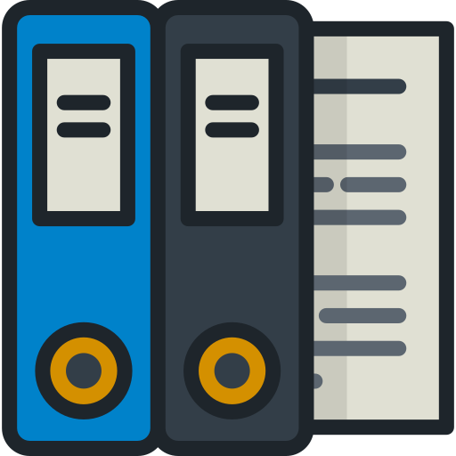

#  The Binder 
> A tiny library for binding data on a web page and storing locally 

## Installing / Getting started

This is hosted on github pages [here](http://bangbangsoftware.github.io/binder/)
A quick introduction of the minimal setup you need to get a hello world up &
running.

## Security

Everything is stored locally, so as long as your local storage is safe, so is your data.

## Developing

A pure js application that makes great use of local storage. 

```shell
# Dependencies
None!

# serve with hot reload at [http://127.0.0.1:8080/](http://127.0.0.1:8080/)
npm start

# build for production with minification 
npm run build - yet to do (Might use rollup) 

# run unit tests
npm run unit - currently there are none

# run e2e tests
npm run e2e - currently there are none

# run all tests
npm test
```

### Built with
Nothing, just pure JS.

### Prerequisites
Nothing, no back end, no babel... just go.

### Building, Deploying / Publishing

To build the project...

```shell
npm run build
```
 This will build the site to dist, which can be commited and served by github
 pages

## To Do

* [ ] Documentation 
* [ ] Swapper 
* [ ] Jest
* [ ] Put on github pages

## Versioning

Undecided.

## Configuration

There is zero configuration as of yet apart from setting up the inital team

## Style guide

Undecided.

## Api Reference

See JSON in local storage

## Licensing

GNU General Public License v3.0


